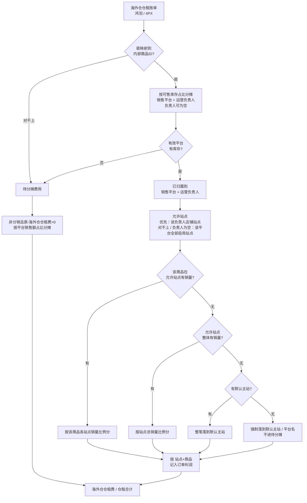

# 海外仓仓租分摊逻辑说明（技术）

面向报表执行与开发对账。业务通俗说明见同目录《仓租的分摊逻辑.doc》。

脚本目录：`modules/K_storage_fee_product_info`（**只用新链路**；旧 `K1_HY` / `K2_4PX` / `K3` / `K4` / `runAll_K` 勿作日常入口）。

日期配置：`config/A0_set_date.py`（`folder_name` / `shared_date` / `ku_cun_date`）。  
金额精度：仓租相关统一 **4 位小数**（`common/cang_zu_decimal.py`）。

---

## 1. 目标与守恒

把鸿羽、4PX 海外仓账单仓租，依次：

1. 按 **可售库存** 分到「销售平台 + 运营负责人」  
2. 按 **订单销量** 分到站点，挂到订单利润行  
3. 仍无法在平台层归属的金额进「无平台」，只摊给「非分销 且 原-海外仓仓租费>0」的行（按这些行平台销售额占比）  

守恒：

\[
\text{已分到站点的海外仓仓租费} + \text{无平台} \approx \text{两仓账单总仓租}
\]

其中 **无平台仅来自 K1_0 平台分摊阶段**（无有效库存等），**不含** K1_3 站点匹配失败差额——站点层会对平台分摊行强制落点。

---

## 2. 结果字段（订单已完成-18）

| 字段 | 含义 |
|---|---|
| 海外仓仓租费 | 行级海外仓仓租（含无平台按销售额占比分摊） |
| 原-海外仓仓租费 | 分摊前的行级仓租 |
| 所有仓库-无平台-需要分摊的费用 | 无平台总额（通常仅第 1 行） |
| 仓租分摊 | 无平台摊到本行的金额（仅海外仓相关非分销行） |
| 仓租合计 | FBA仓租费 + 海外仓仓租费 |

挂接键：`站点商品ID识别码 = 站点 + 商品ID`（**不含**运营负责人）。

---

## 3. 三段归因

| 阶段 | 依据 | 边界 |
|---|---|---|
| ① 平台 | 商品在各销售平台的**可售库存-可调**占比 | 排除「无 / 其他 / ALL」；透传运营负责人（可为空） |
| ② 站点 | 订单**销量**阶梯 + 默认主站 / 强制落点 | 优先「平台 ∩ 负责人」店铺站点；无匹配则回退平台全部启用站点；平台分摊行最终都落到站点 |
| ③ 兜底 | K1_0 无平台总额 | 仅「非分销 且 原-海外仓仓租费>0」按**平台销售额占比**分摊；无库存/未挂海外仓仓租的行不参与 |

### 3.1 业务流程图（当前口径）

示意文件：`docs/仓租分摊流程图.png`。与旧版示意的主要差异：

1. **待分摊只来自平台层**（映射失败 / 无有效库存），不来自站点层  
2. 负责人可为空；负责人在店铺档案对不上时，**回退该平台全部启用站点**  
3. 站点阶梯走完仍落不到点 → **强制落到默认主站/平台名**，不进待分摊  



---

## 4. 流程与产物

```text
K0 库存周转
  → K1_0_HY / K1_0_4PX     → (平台分摊)HY、4PX 仓租明细
  → K1_3（订单15 + platform_shop）→ (平台分摊)所有-海外仓-仓租明细
  → K1_4 → 订单16（月报另写 FBA仓租费）
  → K5 → 订单17 → K6 → 订单18
```

### 4.1 K0 — 库存周转

| 项 | 说明 |
|---|---|
| 源 | `snapshot_market_turnover` |
| 产出 | `…\仓租\{ku_cun_date}库存动销明细.xlsx` |
| 下游用 sheet | **各平台SKU库存周转明细** |

分摊前按 `商品ID + 销售平台 + 运营负责人` 汇总「可售库存-可调」。

### 4.2 K1_0（HY / 4PX）— 账单 → 销售平台

| | HY | 4PX |
|---|---|---|
| 账单 | `仓租\鸿羽\*{日期}.xlsx` | `仓租\4PX\4PX法国仓-仓租明细-{日期}.xlsx` |
| 汇总 | 产品金额 → 产品代码 | 应收金额 → SKU |
| 映射 | warehouse → product_sku → 商品ID（DB） | 同左 |
| 产出 | `(平台分摊)HY-仓租明细.xlsx` | `(平台分摊)4PX-仓租明细.xlsx` |

\[
\text{海外仓仓租费}
= \text{总仓租}
\times \frac{\text{该平台该负责人有效库存}}{\text{该商品ID有效库存合计}}
\]

要点：

- 同平台多名负责人且库存均 > 0 → 输出多行（按负责人库存占比）  
- Sheet「平台分摊」含运营负责人；Sheet「无平台-仓租费用」含原因  
- 映射缺失：写待补全 mapping 并中止（可先 `upProductMapping.py`）  
- HY 仅去前缀 `900008-`

**本步产生的无平台**，才是合并结果里「无平台-仓租费用」的来源。

### 4.3 K1_3 — 合并两仓 → 站点

输入：两仓 `(平台分摊)*`、订单 `(已完成-15)`、`platform_shop`。

| 步骤 | 规则 |
|---|---|
| 合并 | `商品ID + 销售平台 + 运营负责人`（负责人允许为空） |
| 映平台 | 销售平台 → 订单「平台」（DB `market_region→market_code`；未命中回填原文） |
| 允许站点 | 有负责人：优先 `(平台, ops_owner)`；无匹配 → 该平台全部启用站点；仍无 / 负责人为空 → 不限站点 |
| L1 | 同商品ID+平台、允许站点内销量占比 |
| L2 | 同平台、允许站点内总销量加权 |
| L4 | 默认主站（`PLATFORM_TO_SITE`）∈ 允许站点（无白名单时不校验） |
| 强制落点 | 仍未落点 → 默认主站 / 平台名 / 销售平台（**不进无平台**） |

产出：`…\仓租\(平台分摊)所有-海外仓-仓租明细.xlsx`

| Sheet | 内容 |
|---|---|
| 平台分摊 | SKU / 商品ID / 运营负责人 / 平台 / 站点 / 识别码 / 海外仓仓租费；第 1 行写无平台总额 |
| 无平台-仓租费用 | 两仓原无平台明细 + 合计 |

\[
\text{无平台}
= \text{HY 原无平台} + \text{4PX 原无平台}
\quad（\text{不含站点强制落点金额}）
\]

核对：`站点分摊海外仓仓租费 ≈ 两仓平台分摊仓租合计`。

### 4.4 K1_4 — 挂订单（15→16）

1. 读 Sheet「平台分摊」  
2. 按 `站点商品ID识别码` **先 sum**（同键可能多负责人）再 merge  
3. 订单无而仓租有的识别码行追加  
4. 透传无平台 → `所有仓库-无平台-需要分摊的费用`（第 1 行）  

月报：之后 `C2_ManoRent合并` 写 `FBA仓租费`。

### 4.5 K5 / K6（16→17→18）

- **K5**：补运营模式、供应商、分类、产品状态等（写出前可人工检查）  
- **K6**：分销口径收尾；无平台总额仅摊给「非分销 且 原-海外仓仓租费>0」的行（按这些行平台销售额占比）→ 仓租分摊；重算海外仓仓租费与仓租合计。无此类行时仓租分摊全 0，总额留在第 1 行无平台列  

---

## 5. 执行顺序

```text
# 配置 A0_set_date.py 后：
python modules/K_storage_fee_product_info/K0_库存周转.py
python modules/K_storage_fee_product_info/upProductMapping.py   # 缺映射时
python modules/K_storage_fee_product_info/K1_0_HY_仓租.py
python modules/K_storage_fee_product_info/K1_0_4PX_仓租.py
# 订单15：日报 J1 或 月报 J3
python modules/K_storage_fee_product_info/K1_3_合并仓租+站点分摊.py
python modules/K_storage_fee_product_info/K1_4_合并订单统计(月报-需执行ManoRent).py
# 月报：C2_ManoRent合并.py
python modules/K_storage_fee_product_info/K5_映射_产品信息.py
python modules/K_storage_fee_product_info/K6_处理分销_分摊_仓租.py
```

---

## 6. 对账清单

| 现象 | 检查 |
|---|---|
| K1_0 无平台偏多 | 仓库 SKU→商品ID 映射；K0 有效库存；`-NW` 商品ID 是否与 K0 一致 |
| 合并结果无平台 ≠ 两仓原无平台之和 | 应相等；若偏大，说明旧逻辑把站点失败并入了无平台，需重跑当前 K1_3 |
| 站点费用落在非负责人站点 | 负责人与 `platform_shop.ops_owner` 不一致时会回退平台站点；核对档案与库存负责人 |
| 挂不上订单 | 站点原文是否与订单15一致（含 LM 后缀） |
| 金额不平 | 控制台核对：站点分摊≈平台分摊仓租；站点分摊+无平台≈账单总仓租 |
| 没库存 SKU 仍有仓租分摊 | K6 只摊给原-海外仓仓租费>0 的非分销行；若仍有数，看「原-海外仓仓租费」是否已被 K1_3/K1_4 挂上 |

---

## 7. 新旧差异（摘要）

| | 旧 | 新 |
|---|---|---|
| 映射 / 库存 | Excel 手工 | DB mapping + K0 快照 |
| 站点 | 壳站点 + 二次挪费 / LM-BC 对半 | 订单真实站点销量 + 店铺允许站点（可回退平台站点） |
| 无平台 | 常含站点分摊失败 | **仅** K1_0 平台层无法归属部分 |
| 运营负责人 | 不贯穿 | 平台分摊透传；站点优先按负责人闭包，允许为空 |
| 挂订单 | K4 改站点挪费 | 仅识别码合并（先按识别码汇总） |
| 精度 | 不统一 | 统一 4 位小数 |
