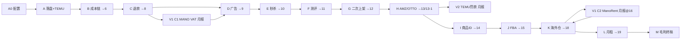

# modules 计算过程说明

跨境电商多平台利润报表的业务流水线。脚本以 Excel 为中间载体，在桌面报表周期目录中按 **A→M**（及月报专用 **V1 / V2**）依次读写；主产物是 `订单统计\(已完成-N)订单统计-{shared_date}.xlsx`，N 随合并步骤递增。

权威目录名为英文（如 `A_temu_order_amount`）。历史中文目录名已迁走，勿再当入口。

更细的专题说明见：

- [`docs/海外仓仓租分摊逻辑说明.md`](../docs/海外仓仓租分摊逻辑说明.md) — K 新链路
- [`docs/F_测评说明.md`](../docs/F_测评说明.md) — 测评费计费口径
- 项目根 [`README.md`](../README.md) — 路径、依赖、快速开始

---

## 1. 命名约定

| 前缀 | 含义 |
|------|------|
| **A0** | 配置（在 `config/`，不在本目录） |
| **A→M** | 主流水线；文件名数字即步骤序（`B4_1` → `B4_2`） |
| **V1 / V2** | 月报变体：`V1_mano_monthly`、`V2_temu_penalty` |
| **runAll_X.py** | 模块内编排（多数按文件名排序；`D` / `M` 用显式列表） |
| **(已完成-N)** | 订单统计中间版本（整条链路的主产物） |
| **(处理完成)** | 侧车明细终稿（广告 / 仓租 / 退款等），再 merge 进订单统计 |

### 识别码（跨模块对齐键）

| 识别码 | 构成 | 典型用途 |
|--------|------|----------|
| SKU-站点识别码 | 站点 + 仓库SKU | 订单行粒度合并 |
| SKU-平台识别码 | 平台 + 仓库SKU | 平台级汇总 |
| 站点商品ID识别码 | 站点 + 商品ID | I 之后仓租 / 汇总 |
| 平台商品ID识别码 | 平台 + 商品ID | 海外仓平台分摊 |

---

## 2. 推荐执行顺序

```text
A0 配置（config/A0_set_date.py、A0_paths.py）
 → A → B → C
 → [月报] V1 C1_*（MANO VAT/佣金，改写已完成-8）
 → D → E → F → G
 → H → [月报] V2 G2_*（TEMU 罚款写入已完成-13「其他分摊费用」）
 → I → J
 → K（海外仓；月报在已完成-16 后跑 V1 C2 ManoRent）
 → L → M
```

`app/run_pipeline.py` **自动跑**：A, B, C, D, F, G, H, K, M。  
**不含**：E、I、J、L、V1、V2（需单独执行）。

下游脚本常对缺省版本做回退（如 F/G/H 从 11→10→9），以兼容跳过 E 等步骤。

---

## 3. 订单统计 `(已完成-N)` 脊柱

| 步骤 | 产出版本 | 写入内容 |
|------|----------|----------|
| A3 | **1** | TEMU 订单总金额回填 |
| B1 | **1-1** | 重发 / 无站点补平台 SKU、站点 |
| B2 | **2** | 映射站点 / 平台 + 识别码 |
| B3 | **3** | 头程、关税 |
| B4 | **4** | AMZ transaction → 销售额 VAT 等 |
| B5 | **5** | MF 尾程 |
| B6 | **5-1** | 非 MF 尾程 |
| B7 | **6** | 儿子识别码合并 + 采购成本 RMB |
| C4 | **7** | 全平台退款合并 |
| C5 | **8** | VAT / 平台费 / 提现费 |
| D6 | **9** | 广告费 |
| E2 | **10** | AMZ 秒杀费 |
| F5 | **11** | 测评费 |
| G5 | **12** | 二次上架 |
| H3 | **13** | AMZ 其他分摊等 |
| H4 | **13-1** | OTTO 客户经理费 |
| I2 | **14** | 按站点商品ID汇总（儿子 → 商品ID） |
| J | **15** | FBA 仓租 |
| K1_4 | **16** | 海外仓仓租 |
| K5 | **17** | 产品信息 |
| K6 | **18** | 分销收尾 + 无平台仓租分摊 |
| L1 | **19** | 店铺月租 |
| M1 | **20** | 毛利 |
| M2 | **21** | 非 AMZ 销售负责人 |
| M3 | **22** | AMZ 销售负责人 |
| M4 | 终稿 | `{shared_date}--{folder_name}.xlsx` |



周期目录侧车输入（由 A1 从网络盘复制）：

```text
{REPORT_PERIOD_DIR}/
├── 订单统计/
├── RMA/
├── transaction交易明细/
├── SellerSku利润报表/
├── 广告/          # OTTO · REAL · MANO · DLZ
├── 测评表/
├── 秒杀/
├── 二次上架/
├── TEMU-罚款/
└── 仓租/          # FBA · 鸿羽 · 4PX · mano · mano-vat
```

---

## 4. 共享配置与工具

### 4.1 `config/A0_set_date.py`

| 项 | 说明 |
|----|------|
| `folder_name` | `日报` \| `月报` |
| `shared_date` | 日报：当月 1 号 → 今天−3 天；月报：上自然月 |
| `ku_cun_date` | 库存快照日（K0 用） |
| `transaction_date` / `fba_date` | transaction、FBA 文件命名 |
| 汇率 | `RMB_di_EUR`、`USD_to_EUR` 等；`RATE_SHIP_FEE`、`SKU_NW_DISCOUNT` |
| 测评 | `test_file_sheet_name`、`test_start_date` / `test_end_date` |
| `month_goal_excel` | AMZ 销售负责人月目标表文件名 |

### 4.2 `config/A0_paths.py`

`DESKTOP_ROOT`、`REPORT_PERIOD_DIR`、`BTH_ALL_SKU_DETAIL_PATH`、`MONTH_GOAL_DIR`、SellerSku 利润报表路径等。

### 4.3 `common/` 关键工具

| 模块 | 用途 |
|------|------|
| `platform_shop.py` | 店铺→站点/平台；站点→VAT/佣金（MySQL `platform_shop` 优先） |
| `sku_mapping.py` | Excel 通用 VLOOKUP 式映射 |
| `split_rows_data_SKU.py` | `+` / `,` 组合 SKU 拆行均摊金额 |
| `cang_zu_site.py` | 库存「平台」标签→订单「站点」 |
| `castorama_commission.py` | Castorama 类目佣金（`runtime/local/castorama_commission.json`） |
| `runall_utils.py` | 子进程跑脚本、按文件名排序、提取输出路径 |

### 4.4 本机 JSON（`runtime/local/`，不入库）

| 文件 | 用途 |
|------|------|
| `mano_mf_fee.json` | B5 MF 尾程兜底 |
| `non_mf_fee.json` | B6 非 MF 尾程兜底 |
| `castorama_commission.json` | C5 / F 佣金 |

### 4.5 主要 DB 表

`sales_order_shipped`、`sales_order_returned`、`temu_order_item`、`platform_shop`、`product_sku`、`product_sku_mapping`、`mano_mmf_price`；快照侧 `snapshot_market_turnover` 等（供 K0）。

---

## 5. 各模块计算过程

### A — `A_temu_order_amount`（TEMU 订单金额 + 日报落盘）

**目的：** 检查/复制日报源文件；给 TEMU 行补单价与运费回款并重算「订单总金额」，产出 `(已完成-1)`。

| 脚本 | 做什么 |
|------|--------|
| `A1_日报文件检查.py` | 检查网络盘源文件，复制到 `REPORT_PERIOD_DIR` |
| `A2_映射_定价_EUR_…py` | TEMU：`temu_order_item` + `手动-二次映射.xlsx` → 单价/运费 EUR |
| `A3_计算_TEMU_订单总金额.py` | 非 TEMU + TEMU 拼接；过滤问题件/冻结/指定店铺 → **已完成-1** |

**输入：** 网络盘日报；`temu_order_item`；桌面手动二次映射  
**输出：** 周期目录各子文件夹；`(已完成-1)订单统计`  
**入口：** `runAll_A.py`

---

### B — `B_order_stats_sale_resend`（订单统计主成本链）

**目的：** 站点/识别码 → 头程关税 → AMZ 交易 → MF/非MF 尾程 → 采购成本；核心成本列成型。

| 脚本 | 做什么 |
|------|--------|
| `B1_查询重发平台SKU.py` | DB `sales_order_shipped` 补重发/无站点的平台 SKU、站点 → **1-1** |
| `B2_映射站点_构建识别码.py` | `platform_shop` 映射站点/平台；LM_FR 按 sku 加 `-ls/-xj`；生成识别码 → **2** |
| `B3_映射_头程_关税.py` | `BTH全部SKU明细` 等映射头程/关税 → **3** |
| `B4_1_合并_transaction…py` | 合并已发放/已推迟 transaction → `(处理完成)transaction…` |
| `B4_2_映射_AMZ_transaction…py` | 交易明细并入订单；平台销售额 VAT 等 → **4** |
| `B5_映射_MF_尾程.py` | MANO-MF：Excel + `mano_mmf_price` + `mano_mf_fee.json` → **5**（常 pause 人工核空值） |
| `B6_映射_非MF_尾程.py` | DB 派送费 / 欧洲定价表 / `non_mf_fee.json` → **5-1** |
| `B7_合并_儿子-站点识别码_映射_采购成本RMB.py` | 组合 SKU 汇总；采购成本；分销标记 → **6** |

**依赖：** A  
**入口：** `runAll_B.py`

---

### C — `C_refund`（退款）

**目的：** RMA + AMZ SellerSku 退款 → 全平台退款表 → 并入订单统计；再算 VAT / 佣金 / 提现费。

| 脚本 | 做什么 |
|------|--------|
| `C1_1查询退款平台SKU.py` | RMA 清洗；`sales_order_shipped` 补平台 sku → `(已完成-1)RMA`（LM-BC/RP 常需人工 ERP） |
| `C1_2_映射站点构建识别码.py` | 站点/平台/识别码/分销 → `已完成-1-1` RMA |
| `C1_3_合并_RMA退款.py` | 非 Amazon RMA 汇总 → `处理完成-无Amazon` |
| `C2_1` / `C2_2` | SellerSku 算/合并 AMZ 退款 VAT、平台费 |
| `C3_合并_所有退款.py` | RMA + AMZ → `(处理完成)所有平台-退款.xlsx` |
| `C4_合并_订单统计_.py` | 退款并入 **6→7** |
| `C5_…VAT_平台费_提现费…py` | `platform_shop` + Castorama JSON；算非 AMZ 平台费/销售税/提现费 → **8**（月报 MANO 实际值由 V1 覆盖） |

**依赖：** A、B（要 **6**）；SellerSku 报表（A1 复制）  
**入口：** `runAll_C.py`

---

### V1 — `V1_mano_monthly`（仅月报 · MANO VAT / 佣金 / 仓租）

**目的：** 用 Mano 官方 VAT / 佣金 / MMF 仓租覆盖估算值。无 `runAll`，手动按序执行。

| 脚本 | 做什么 | 插入点 |
|------|--------|--------|
| `C1_1_Mano_vat.py` | 读 `仓租\mano-vat\`；拆组合 SKU；回填仓库SKU/商品ID | C5 之后 |
| `C1_2_Mano合并VAT.py` | 按 SKU-站点识别码汇总 | |
| `C1_3_Mano_合并统计.py` | 写入 **已完成-8**：MANO-EU 平台费/销售税清零后回填实际值；备份 `…-original.xlsx` | |
| `C2_ManoRent.py` | `仓租\mano\*@*.xlsx` → `ALL-WarehouseRent.xlsx` | K1_4 之后、K5 之前 |
| `C2_ManoRent合并.py` | 汇总写入 **已完成-16** 的「FBA仓租费」（覆盖匹配行） | |

---

### D — `D_ads`（广告：OTTO / REAL / MANO / DLZ）

**目的：** 各平台广告清洗映射 → 统一广告费用 → 并入订单统计。

| 脚本 | 做什么 |
|------|--------|
| `D1_OTTO.py` | OTTO CSV → `(处理完成)OTTO广告.xlsx` |
| `D2_REAL.py` | 多站点 REAL CSV → `(处理完成)REAL广告.xlsx` |
| `D3_MANO.py` | MANO 多目录 CSV → `(处理完成)MANO广告.xlsx` |
| `D4_1`…`D4_4` | DLZ shopping：美元→销量分摊→欧元（`D4_3` 用订单 **6**；`D4_4` 用 `DLZ-FR_广告分摊sku.xlsx`） |
| `D5_…所有平台广告.py` | 合并 → `广告\(处理完成)所有平台广告费用.xlsx` |
| `D6_合并_订单统计.py` | **8→9** |

**依赖：** B（D4_3 要 6）；C5（D6 要 8）  
**入口：** `runAll_D.py`（显式顺序；注意 `D4_4_….py.py` 双后缀文件名）

---

### E — `E_amz_seckill_cost`（AMZ 秒杀）

无 `runAll`。无秒杀数据时可跳过；F/G/H 会回退读 **9**。

| 脚本 | 做什么 |
|------|--------|
| `E1_秒杀_映射_站点识别码.py` | `秒杀\秒杀数据-*.xlsx` → `(处理完成)…` |
| `E2_合并_订单统计.py` | **9→10** |

---

### F — `F_review_cost`（测评）

**目的：** 测评表按规则算测评费并入订单。计费口径见 [`docs/F_测评说明.md`](../docs/F_测评说明.md)。

| 类型（摘要） | 计入项 |
|--------------|--------|
| 佣金、好评返现 | 仅佣金 |
| 空包退订单金额 | 提现费、佣金、VAT |
| 测评退订单金额 70% | 头程/关税/尾程/采购成本 + (佣金、VAT、提现费)×70% |
| 测评退订单金额 | 头程/关税/尾程/采购成本 + (佣金、VAT、提现费)×100% |

| 脚本 | 做什么 |
|------|--------|
| `F1_测评表_识别码.py` | 日期筛选、SKU 拆分、站点、币种、VAT/平台费 |
| `F2_映射_各种成本.py` | 头程/尾程/采购等成本映射 |
| `F3_计算_测评费.py` | 按类型计算测评费 |
| `F4_合并_儿子-站点识别码.py` | 汇总 → `(处理完成)测评表` |
| `F5_合并_订单统计.py` | **10→11**（无 10 则用 9） |

**入口：** `runAll_F.py`

---

### G — `G_returned_reshelf`（退货二次上架）

**目的：** 鸿羽二次上架明细 → 金额/采购成本 → 并入订单。目录无 G2（V2 TEMU 罚款已独立）。

| 脚本 | 做什么 |
|------|--------|
| `G1_查询退件的映射信息.py` | 读二次上架明细；映射 `sales_order_returned` / RPA 结果 |
| `G3_计算_二次上架金额_映射_采购成本RMB.py` | 金额 + BTH 采购成本；LM 手动二次映射兜底 |
| `G4_合并_儿子-站点识别码.py` | → `(处理完成)…` |
| `G5_合并_订单统计.py` | → **12** |

**入口：** `runAll_G.py`

---

### V2 — `V2_temu_penalty`（仅月报 · TEMU 罚款）

无 `runAll`。通常在 H3 产出 **13** 之后执行。

| 脚本 | 做什么 |
|------|--------|
| `G2_1_Temu罚款合并.py` | `TEMU-罚款\*罚款*.xlsx` 支出 sheet 合并换汇 |
| `G2_2_Temu罚款映射.py` | `sales_order_shipped` 拆 SKU、按发货量摊 |
| `G2_3_Temu合并统计.py` | 累加进 **已完成-13**「其他分摊费用」 |

---

### H — `H_amz_profit_otto_manager_fee`

**目的：** SellerSku 利润报表 → 广告/赔偿/其他费用分摊到订单；OTTO 客户经理费。

| 脚本 | 做什么 |
|------|--------|
| `H1_映射_计算.py` | SellerSku 清洗、拆组合 SKU、站点映射 |
| `H2_合并_儿子-站点识别码.py` | → `(处理完成)SellerSku…` |
| `H3_…分摊_其他费用…py` | 按平台销售额等分摊「其他分摊费用」等 → **13**（月报后可接 V2） |
| `H4_…OTTO_客户经理费.py` | OTTO 客户经理费 → **13-1** |

**入口：** `runAll_H.py`

---

### I — `I_son_report_product_id`（儿子 → 商品ID）

无 `runAll`。

| 脚本 | 做什么 |
|------|--------|
| `I2_映射_合并_站点商品ID识别码.py` | `产品信息库` 映射商品ID；按站点商品ID汇总 → **14** |
| `monthly/I1_输出_儿子报表.py` | 月报：输出无仓租 SKU 版 `{shared_date}--{folder_name}-无仓租(SKU版).xlsx` |

**依赖：** H（**13-1**）

---

### J — `J_amz_storage_fee`（FBA 仓租）

无 `runAll`。依赖 I（**14**）；源文件在 `仓租\FBA仓租\`，命名用 `fba_date`。

| 路径 | 脚本 | 产出 |
|------|------|------|
| **日报** `daily/` | `J1_计算_AMZ仓租_合并_订单统计.py` | **14→15** |
| **月报** `monthly/` | `J1` → `J2` → `J3` | 算仓租、合并识别码、并入订单 → **15** |

---

### K — `K_storage_fee_product_info`（海外仓仓租 + 产品信息）

**目的：** HY / 4PX 仓租按库存占比摊到平台/站点 → 并入订单 → 产品属性 → 无平台费用分摊。  
详解见 [`docs/海外仓仓租分摊逻辑说明.md`](../docs/海外仓仓租分摊逻辑说明.md)。

#### 新链路（推荐，DB + K0）

| 脚本 | 做什么 |
|------|--------|
| `K0_库存周转.py` | `snapshot_market_turnover` → `{ku_cun_date}库存动销明细.xlsx` |
| `upProductMapping.py` | 回填 `product_sku_mapping` 空 product_sku（映射缺失时先跑） |
| `K1_0_HY_仓租.py` | HY 账单 → `(平台分摊)HY-仓租明细.xlsx` |
| `K1_0_4PX_仓租.py` | 4PX 账单 → `(平台分摊)4PX-仓租明细.xlsx` |
| `K1_3_合并仓租+站点分摊.py` | 合并 + 按订单销量阶梯摊到站点 |
| `K1_4_合并订单统计…py` | **15→16**；透传无平台费用（月报后接 V1 C2） |
| `K5_映射_产品信息.py` | DB `product_sku` + 产品信息库 → **17** |
| `K6_处理分销_分摊_仓租.py` | 分销规则；无平台仓租均摊；`仓租合计` → **18** |

核心原则：

1. **能归属平台的**：用 K0「可售库存-可调」占比拆到销售平台（排除 `无` / `其他` / `ALL` 作分母）。
2. **能归属站点的**：用订单销量阶梯，尽量把费用留在同一销售平台内。
3. **仍无法归属的**：进「无平台」，K6 对非分销行平均分摊。

#### 旧链路（仍保留，勿日常混用）

`K1_HY` → `K2_4PX` → `K3` → `K4` → `K5` → `K6`。

> **注意：** `runAll_K.py` 按文件名排序，会把新旧脚本一并串跑。生产请按文档**手动跑新链路**，或改 runAll 白名单；勿盲跑。

---

### L — `L_shop_rent_allocation`（店铺月租）

无 `runAll`。

| 脚本 | 做什么 |
|------|--------|
| `L1_计算月租_合并_分摊_订单统计.py` | `月租总摊分.xlsx` 按站点摊到订单 → **18→19** |

**依赖：** K6

---

### M — `M_gross_profit_owner_headers`（毛利与负责人）

| 脚本 | 做什么 |
|------|--------|
| `M1_计算毛利.py` | 采购成本调整（易速 / 1.13 / `-NW`）；算毛利 → **20** |
| `M2_映射_销售负责人_非AMZ.py` | `信息-映射.xlsx` → **21** |
| `M3_映射_销售负责人_AMZ.py` | 月目标拆解表 + 信息映射 → **22** |
| `M4_映射_销售经理_表头排序.py` | 负责人/经理；列排序；终稿 `{shared_date}--{folder_name}.xlsx` |

**毛利公式（2026-06 起二次上架不进公式）：**

```text
毛利 = 销售额
     - 测评费 - 秒杀费 - 广告费合计 - 平台费合计 - 销售税合计
     - 派送费 - 提现费 - 其他分摊费用 - 采购成本 - 头程 - 关税 - 仓租合计 - 月租
     + 赔偿金额
```

特例：

- 供应商为「智慧谷」且销售额 ≠ 0 → 毛利 = 销售额 × 5%
- 出表前将「二次上架金额」「二次上架采购成本」清零（公司承担，与销售日报无关）

**入口：** `run_all_gross_profit.py`

---

## 6. 日报 vs 月报

| 项目 | 日报 | 月报 |
|------|------|------|
| `folder_name` | `日报` | `月报` |
| V1 Mano VAT / Rent | 一般不跑 | C1_* @8；C2_* @16 |
| V2 TEMU 罚款 | 一般不跑 | G2_* 写入 13 |
| J | `daily/J1` | `monthly/J1`–`J3` |
| I1 儿子报表 | 可选 | `monthly/I1` |
| 文件名含「手动操作」的脚本 | 偶发核对 | 常需人工核对 |

---

## 7. 编排入口

```powershell
# 有 runAll 的模块（不含 E / I / J / L / V1 / V2）
python -m app.run_pipeline
python -m app.run_pipeline --only A,B,C

python modules/A_temu_order_amount/runAll_A.py
python modules/B_order_stats_sale_resend/runAll_B.py
python modules/C_refund/runAll_C.py
python modules/D_ads/runAll_D.py
python modules/F_review_cost/runAll_F.py
python modules/G_returned_reshelf/runAll_G.py
python modules/H_amz_profit_otto_manager_fee/runAll_H.py
# K：优先按 docs 手动跑新链路，勿依赖盲跑 runAll_K
python modules/M_gross_profit_owner_headers/run_all_gross_profit.py

# 无 runAll 示例
python modules/E_amz_seckill_cost/E1_秒杀_映射_站点识别码.py
python modules/I_son_report_product_id/I2_映射_合并_站点商品ID识别码.py
python modules/J_amz_storage_fee/daily/J1_计算_AMZ仓租_合并_订单统计.py
python modules/L_shop_rent_allocation/L1_计算月租_合并_分摊_订单统计.py
```

相关但非本流水线主链：`app/delivery_fee_hy.py`（鸿羽派送费试算）、`app/ding-disk/*`（钉钉映射同步）、`snapshot/*`（库存周转，供 K0）。
